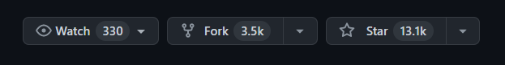
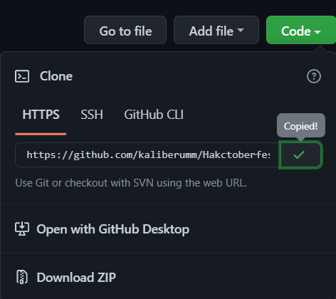
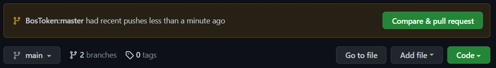

# Hacktoberfest 2022


<h2 align="center">Stay Tune</h2>

<p align="center">
    <a href="https://www.instagram.com/kaliber.umm/">
        
    </a>
    <a href="https://t.me/kaliberumm">
        
    </a>
    <a href="https://discord.com/invite/bUaQHpwn9Z">
        
    </a>
</p>

## 🛠️ How To Contribute

### 1. Fork the Repository
Fork this repository by pressing the ``Fork`` button in the upper right corner.



### 2. Clone Repository
Now, Clone this Repository by copying the link on the Code button.


Run your terminal and type : 
```
git clone <paste your link>
```

### 3. Make a Branch
Now, you have to create a Branch in the folder that is already filled with this repository.

run this command to create a repository in a local file :
```
git init
```

now, add the remote with the repository you fork :
```
git remote add origin <your repository fork link>
```

### 4. Your Contributor
then, add the file or code that you will contribute to this project.

### 5. Push Your Contribution
after you contribute, you have to give push command to your repository.

run this command for the file you want to push  :
``` 
git add <your file>
```

then, run this command to commit your pull request :
```
git commit -m "<your commit name>"
```

now, push your commit to your repository by running the command :
```
git push origin <your branch name>
```

### Make a Pull Request 
After that, in your repository there is a request to make a pull request.


click `Compare & pull request` button.

Soon I will merge all your changes into the main branch of this project. You will receive an email notification once the changes are merged.

Enjoy it 🙃!!!
